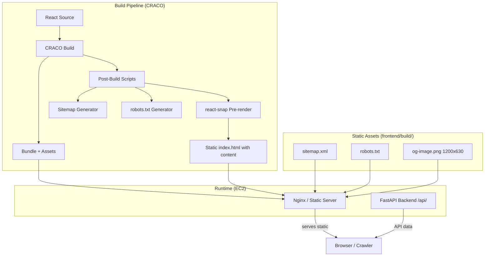
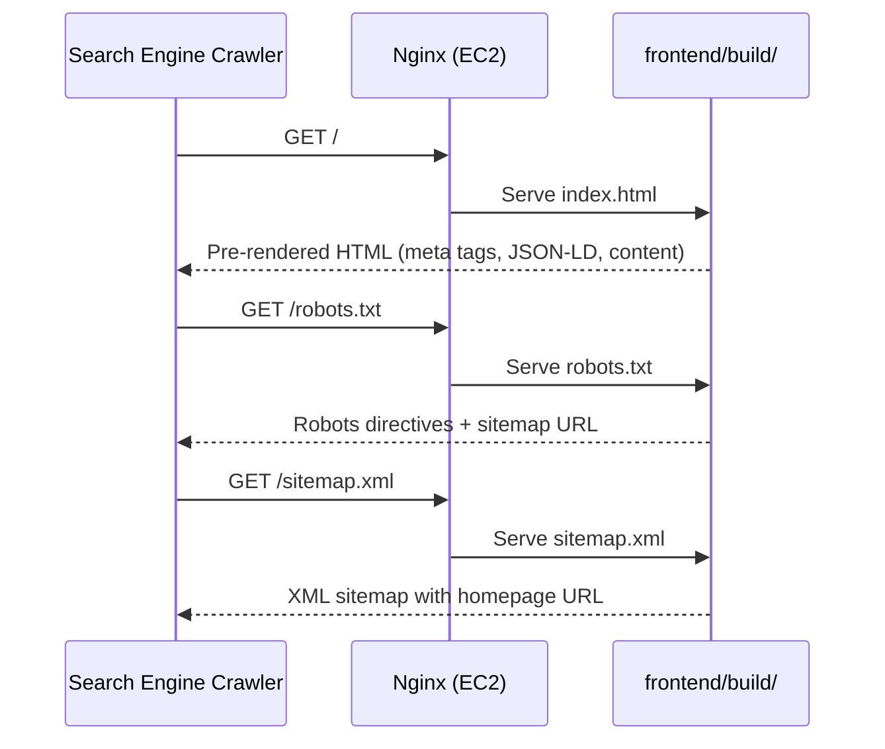

# Design Document: SEO Optimization

## Overview

This design covers comprehensive SEO optimization for Sujal Meena's portfolio website — a single-page React application (CRA + CRACO) with a FastAPI backend, deployed on EC2. The optimization spans meta tags, structured data, sitemap generation, robots.txt, semantic HTML, image optimization, Core Web Vitals performance, pre-rendering for crawlers, mobile-friendliness, and URL/link optimization.

The key architectural challenge is that the site is a client-rendered SPA where content is fetched from the backend API at runtime. Search engines need static HTML with meta tags and content available without JavaScript execution. The design addresses this through a build-time pre-rendering approach integrated into the CRACO build pipeline.

### Design Decisions

1. **Pre-rendering via react-snap** rather than SSR (Next.js migration): Keeps the existing CRA+CRACO stack intact while producing static HTML snapshots at build time. Lower migration cost, sufficient for a single-page portfolio.
2. **Build-time sitemap generation** via a custom post-build script rather than a runtime endpoint: The site has a single URL, making dynamic generation unnecessary.
3. **JSON-LD in index.html** rather than injected by React: Ensures structured data is available in the initial HTML without JS execution.
4. **CRACO webpack plugin** for resource optimization: Leverages the existing build system for code splitting, preloading, and lazy loading.

## Architecture



### Request Flow for Crawlers



## Components and Interfaces

### 1. Meta Tag System (`frontend/public/index.html`)

Responsible for all `<head>` meta tags including title, description, Open Graph, Twitter Cards, and canonical URL.

**Interface:**
- Static HTML in `<head>` section
- No runtime dependencies — all values are hardcoded at build time

**Tags to include:**
| Tag | Value Pattern |
|-----|--------------|
| `<title>` | "Sujal Meena — Full-Stack AI Engineer" (30-60 chars) |
| `<meta name="description">` | 150-160 char summary |
| `<meta property="og:title">` | Same as title |
| `<meta property="og:description">` | Same as description |
| `<meta property="og:image">` | Absolute URL to og-image.png |
| `<meta property="og:url">` | Production canonical URL |
| `<meta property="og:type">` | "website" |
| `<meta name="twitter:card">` | "summary_large_image" |
| `<meta name="twitter:title">` | Same as title |
| `<meta name="twitter:description">` | Same as description |
| `<meta name="twitter:image">` | Absolute URL to og-image.png |
| `<link rel="canonical">` | Production domain URL |

### 2. Structured Data Module (`frontend/public/index.html`)

JSON-LD scripts embedded directly in the HTML `<head>` for crawler availability without JS.

**Interface:**
```typescript
interface PersonSchema {
  "@context": "https://schema.org";
  "@type": "Person";
  name: string;
  jobTitle: string;
  url: string;
  sameAs: string[]; // social profile URLs
}

interface WebSiteSchema {
  "@context": "https://schema.org";
  "@type": "WebSite";
  name: string;
  url: string;
  description: string; // max 160 chars
}
```

### 3. Sitemap Generator (`frontend/scripts/generate-sitemap.js`)

A Node.js script that runs as a post-build step to produce `sitemap.xml`.

**Interface:**
```typescript
interface SitemapConfig {
  baseUrl: string;       // production domain
  outputPath: string;    // frontend/build/sitemap.xml
  changefreq: string;    // "monthly"
  priority: string;      // "1.0"
}

function generateSitemap(config: SitemapConfig): void;
// Throws Error if file cannot be written
```

### 4. Robots.txt Generator (`frontend/scripts/generate-robots.js`)

A Node.js script that produces `robots.txt` as a post-build step.

**Interface:**
```typescript
interface RobotsConfig {
  sitemapUrl: string;    // absolute URL to sitemap.xml
  disallowPaths: string[]; // ["/api/"]
}

function generateRobots(config: RobotsConfig): void;
```

### 5. Pre-Renderer (react-snap integration)

Configured via `package.json` to run after the CRA build, producing static HTML with rendered content.

**Interface:**
```json
{
  "reactSnap": {
    "source": "build",
    "inlineCss": true,
    "puppeteerArgs": ["--no-sandbox"]
  }
}
```

### 6. SEO Component Enhancements

Updates to existing React components for semantic HTML, heading hierarchy, and accessibility.

**Affected components:**
- `App.js` — Add `<header>`, `<main>`, `<footer>` semantic wrappers
- `Hero.jsx` — Ensure single `<h1>`, lazy-load Three.js canvas
- `About.jsx` — Add `<h2>`, `aria-labelledby`, lazy-load Three.js canvas
- `Skills.jsx` — Add `<h2>`, `aria-labelledby`
- `Projects.jsx` — Add `<h2>`, `aria-labelledby`, fix image alt text format, add `<article>` (already present)
- `Contact.jsx` — Fix heading to `<h2>` for section title, `aria-labelledby`
- `Navbar.jsx` — Already has `<header>`, `<nav aria-label="Primary">`
- `Footer.jsx` — Already uses `<footer>`

### 7. Image Optimization Utilities

**Alt text formatter:**
```typescript
function formatProjectAltText(projectName: string, description: string): string;
// Returns: "{projectName} - {description}" truncated to 125 chars
// If no description: returns projectName (5-125 chars)
```

**Image error handler:**
```typescript
function handleImageError(event: React.SyntheticEvent, projectName: string): void;
// Sets fallback text, maintains reserved space
```

### 8. Performance Optimization (CRACO config)

Webpack configuration additions for resource hints and lazy loading:
- `rel="preload"` for critical fonts (Inter)
- `loading="lazy"` on below-fold images
- Intersection Observer wrapper for Three.js canvases
- Code splitting for non-critical components (ChatWidget, FloatingParticles)

## Data Models

### Meta Tag Configuration

```javascript
// frontend/src/config/seo.js
const SEO_CONFIG = {
  title: "Sujal Meena — Full-Stack AI Engineer",
  description: "Full-Stack AI Engineer specializing in agentic workflows, RAG pipelines, and high-performance web applications. View projects, skills, and get in touch.",
  canonicalUrl: "https://sujalmeena.dev",
  ogImage: "https://sujalmeena.dev/og-image.png",
  ogType: "website",
  twitterCard: "summary_large_image",
  person: {
    name: "Sujal Meena",
    jobTitle: "Full-Stack AI Engineer",
    url: "https://sujalmeena.dev",
    sameAs: [
      "https://github.com/sujalmeena7",
      "https://www.linkedin.com/in/sujal-meena-170418371"
    ]
  },
  website: {
    name: "Sujal Meena Portfolio",
    url: "https://sujalmeena.dev",
    description: "Portfolio of Sujal Meena, a Full-Stack AI Engineer building intelligent agentic workflows and high-performance digital systems."
  }
};
```

### Sitemap Entry Model

```xml
<?xml version="1.0" encoding="UTF-8"?>
<urlset xmlns="http://www.sitemaps.org/schemas/sitemap/0.9">
  <url>
    <loc>https://sujalmeena.dev/</loc>
    <lastmod>2024-01-15</lastmod>
    <changefreq>monthly</changefreq>
    <priority>1.0</priority>
  </url>
</urlset>
```

### Robots.txt Model

```text
User-agent: *
Allow: /
Disallow: /api/

Sitemap: https://sujalmeena.dev/sitemap.xml
```

## Correctness Properties

*A property is a characteristic or behavior that should hold true across all valid executions of a system — essentially, a formal statement about what the system should do. Properties serve as the bridge between human-readable specifications and machine-verifiable correctness guarantees.*

### Property 1: Structured Data Required Fields Validation

*For any* JSON-LD structured data object of type "Person" or "WebSite", the validation function SHALL correctly identify whether all required properties (name, jobTitle, url, sameAs for Person; name, url, description for WebSite) contain non-empty string values.

**Validates: Requirements 2.5**

### Property 2: Sitemap XML Schema Conformance

*For any* valid URL string and date, the sitemap generator SHALL produce XML output that conforms to the Sitemaps.org protocol 0.9 schema, containing a valid `<urlset>` root element with proper namespace, and `<url>` entries with `<loc>`, `<lastmod>` (YYYY-MM-DD format), `<changefreq>`, and `<priority>` elements.

**Validates: Requirements 3.1**

### Property 3: Heading Hierarchy Sequential Ordering

*For any* sequence of heading elements (h1-h6) in the rendered DOM, no heading level SHALL be skipped — meaning if a heading of level N appears, the next heading must be level N, N+1, or any level less than N (closing a subsection), but never greater than N+1.

**Validates: Requirements 5.3**

### Property 4: Alt Text Format and Length Validation

*For any* project name and image description string, the alt text formatter SHALL produce output in the format "[Project Name] - [description]" with a total length between 5 and 125 characters, truncating the description if necessary to meet the maximum length constraint while preserving the project name prefix.

**Validates: Requirements 6.1, 6.3**

### Property 5: No Horizontal Overflow Across Viewport Range

*For any* viewport width between 320px and 1024px inclusive, the rendered page content SHALL not produce horizontal overflow (i.e., `document.documentElement.scrollWidth <= window.innerWidth`).

**Validates: Requirements 9.2**

### Property 6: Touch Target Minimum Dimensions

*For any* interactive element (button, link, form input) rendered at a viewport width of 1024px or less, the element's tappable area SHALL be at least 48x48 CSS pixels, and the spacing between adjacent interactive elements SHALL be at least 8px.

**Validates: Requirements 9.3**

### Property 7: Descriptive Anchor Text Validation

*For any* internal navigation link in the page, the visible anchor text SHALL contain at least one word identifying the target section (e.g., "About", "Skills", "Work", "Contact") and SHALL NOT consist solely of generic phrases such as "click here", "read more", "link", or "here".

**Validates: Requirements 10.1**

### Property 8: External Link Security Attributes

*For any* anchor element with `target="_blank"` pointing to a domain other than the site's own domain, the `rel` attribute SHALL contain both "noopener" and "noreferrer".

**Validates: Requirements 10.2, 10.5**

### Property 9: Hash Link Target Existence

*For any* internal hash link `href` value (e.g., `#about`, `#skills`), there SHALL exist an element in the rendered DOM with an `id` attribute matching the hash fragment (without the `#` prefix).

**Validates: Requirements 10.3**

## Error Handling

### Image Load Failures (Requirement 6.5)
- **Trigger:** `` `onerror` event fires
- **Behavior:** Replace image with a styled fallback container showing the project name as text. Maintain the reserved image dimensions via CSS `aspect-ratio` to prevent layout shift.
- **Implementation:** `onError` handler on `` elements in `ProjectCard` that sets a `loadFailed` state, rendering a fallback `<div>` with the project title.

### Sitemap Generation Failure (Requirement 3.5)
- **Trigger:** File write fails during post-build script
- **Behavior:** Script exits with non-zero code and logs `"ERROR: Sitemap generation failed: <reason>"` to stderr. The CI/CD pipeline treats this as a build failure.
- **Implementation:** `try/catch` in `generate-sitemap.js` with `process.exit(1)` on failure.

### Missing Hash Link Target (Requirement 10.4)
- **Trigger:** User clicks a hash link whose target `id` doesn't exist in the DOM
- **Behavior:** The `handleNav` function in `Navbar.jsx` already checks `if (el)` before calling `scrollIntoView`. If `el` is null, no scroll occurs and the page stays at the current position.
- **Implementation:** The existing pattern (`const el = document.querySelector(href); if (el) el.scrollIntoView(...)`) already handles this gracefully.

### JavaScript Disabled (Requirement 8.4)
- **Trigger:** Browser has JavaScript disabled
- **Behavior:** The `<noscript>` element displays a message directing the user to enable JavaScript. Pre-rendered content remains visible in the static HTML.
- **Implementation:** Update the existing `<noscript>` tag content to be more descriptive: "This portfolio requires JavaScript for full interactivity. Please enable JavaScript in your browser settings to view all content."

### Pre-render Content Mismatch (Requirement 8.5)
- **Trigger:** Pre-rendered HTML diverges from hydrated React output
- **Behavior:** React hydration warnings appear in development console. In production, React will patch the DOM to match the virtual DOM.
- **Mitigation:** Ensure pre-rendered content uses the same data source (mock data for static content, API data fetched during pre-render for dynamic content). Use `react-snap`'s network interception to capture API responses during pre-rendering.

## Testing Strategy

### Unit Tests (Jest + React Testing Library)

Unit tests cover specific examples and edge cases:

- **Meta tags:** Verify all required meta tags exist with correct values in the rendered HTML head
- **Structured data:** Parse JSON-LD scripts and verify schema compliance
- **Semantic HTML:** Verify heading hierarchy, landmark elements, aria attributes
- **Image alt text:** Verify format and length for specific project examples
- **Robots.txt content:** Verify directives match expected format
- **Sitemap content:** Verify XML structure and values
- **Noscript fallback:** Verify noscript element content
- **Image error handling:** Simulate load failure and verify fallback rendering
- **Link attributes:** Verify rel attributes on external links

### Property-Based Tests (fast-check)

Property-based tests verify universal properties across generated inputs. The library `fast-check` will be used for JavaScript property-based testing.

**Configuration:**
- Minimum 100 iterations per property test
- Each test tagged with: `Feature: seo-optimization, Property {number}: {property_text}`

**Properties to implement:**
1. Structured data validation function (Property 1)
2. Sitemap XML generation (Property 2)
3. Heading hierarchy validator (Property 3)
4. Alt text formatter (Property 4)
5. Descriptive anchor text validator (Property 7)
6. External link rel attribute checker (Property 8)
7. Hash link target existence checker (Property 9)

**Note:** Properties 5 and 6 (viewport overflow and touch targets) require browser rendering and are better suited to integration tests with Playwright/Puppeteer across viewport sizes rather than fast-check property tests.

### Integration Tests (Playwright)

- **Core Web Vitals:** Run Lighthouse CI against the built site to verify LCP, CLS, INP thresholds
- **Mobile responsiveness:** Test at viewport widths 320, 375, 768, 1024px for overflow and touch target sizing
- **Pre-rendering verification:** Fetch built HTML and verify content presence without JS
- **Social preview:** Verify meta tags are present in raw HTML response
- **Sitemap/robots.txt serving:** Verify files are accessible at correct paths

### Smoke Tests

- **Build output:** Verify `sitemap.xml` and `robots.txt` exist in `frontend/build/` after build
- **Viewport meta tag:** Verify presence in index.html
- **OG image dimensions:** Verify og-image.png is at least 1200x630px
- **Image file sizes:** Verify all images are under 500 KB
